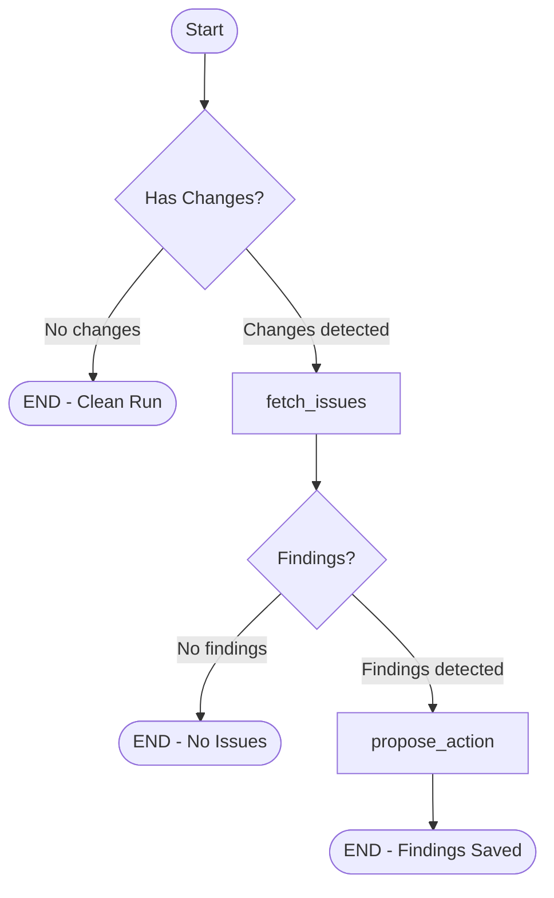
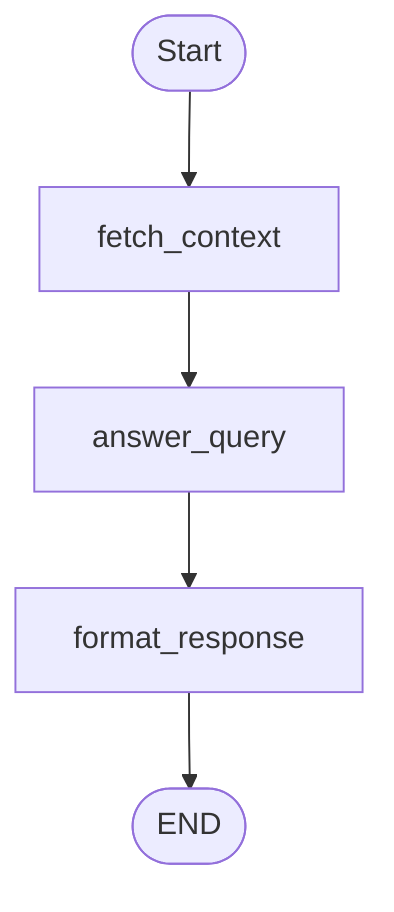

# FLEETGRAPH.md

## Agent Responsibility

FleetGraph is a **project intelligence agent** for Ship that monitors project state, reasons about what it finds, and surfaces actionable insights. It operates in two modes:

**Proactive Mode** - Runs on a schedule (3-min fast poll, 30-min slow poll), detects problems (stale issues, scope creep, missing standups), and surfaces findings with proposed actions. Findings require human approval before any write action is taken.

**On-Demand Mode** - User invokes from the Ship UI via a context-aware chat panel. FleetGraph fetches relevant workspace/document data and answers questions about project health, risks, priorities, and status.

**What the agent can do without approval:**
- Read any workspace-visible data
- Compute derived metrics (velocity, capacity utilization, scope delta)
- Generate summaries, risk assessments, and recommendations

**What requires human approval (human-in-the-loop gate):**
- Adding comments to documents
- Changing issue state or assignments
- Creating new documents
- Any action that modifies another user's workload

---

## Graph Architecture

### Proactive Graph (Stale Issue Detection)

**Path A** - Findings detected: `fetch_activity → fetch_issues → detect_stale → propose_action → END`
**Path C** - Clean run (no changes): `fetch_activity → END`

### On-Demand Graph (Chat)

**Path B** - On-demand: `fetch_context → answer_query → format_response → END`

### Human-in-the-Loop Gate

Findings from the proactive graph are persisted to the `fleetgraph_findings` table with `status: 'pending'`. Users interact with findings via:

1. **Findings tab** in the FleetGraph chat panel - shows pending findings with Approve/Dismiss buttons
2. **REST API** - `POST /api/fleetgraph/findings/:id/approve` or `/dismiss`

When approved, the `execute_action` function runs the proposed action (e.g., adding a comment to a stale issue). Dismissed findings are suppressed for 7 days.

---

## Use Cases

| # | Role | Trigger | Agent Detects / Produces | Human Decides |
|---|------|---------|--------------------------|---------------|
| 1 | Week Owner | Proactive: daily scan | **Scope creep alert** - Issues added after plan submission. Estimates impact on capacity. | Defer new issues or accept scope increase |
| 2 | Issue Assignee | Proactive: 48h scan | **Stale issue detection** - In-progress issues with no activity for 48+ hours. | Update status, log blocker, or deprioritize |
| 3 | Project Owner | On-demand | **Project health report** - Velocity trends, hypothesis validation, ICE trajectories, recurring blockers. | Escalate, adjust scope, or continue |
| 4 | Workspace Admin | Proactive: weekly | **Missing rituals** - Completed weeks with no retro, new weeks with no plan. | Follow up with team members |
| 5 | Any Member | On-demand | **Daily priority synthesis** - Highest-impact next actions considering deadlines and dependencies. | Follow recommendation or reprioritize |
| 6 | Week Owner | On-demand | **Standup draft** - Reviews issue activity since last standup, drafts entry. | Post as-is, edit, or discard |
| 7 | Project Owner | Proactive | **Sprint-over-sprint trends** - Velocity delta, scope change frequency across weeks. | Adjust planning approach |
| 8 | Workspace Admin | On-demand | **Workload balance** - Capacity utilization across team members, over/under-allocation. | Rebalance assignments |

---

## Trigger Model

**Hybrid Polling** (no webhook system exists in Ship):

| Poll Type | Interval | What it Does | LLM Cost |
|-----------|----------|-------------|----------|
| Fast poll | 3 min | Hit activity feed, check for changes via hash. If no changes, short-circuit. | $0 (no LLM call) |
| Deep scan | On change | Fetch full issue data, run LLM reasoning to classify findings. | ~$0.016/scan |
| Slow poll | 30 min | Full scan for absence-based conditions (missing standups, retros). | ~$0.016/scan |

**Why polling over webhooks:** Ship has no pub/sub or event system. Building one is out of scope. The 3-min fast poll with activity-hash gating achieves <5 minute detection latency while minimizing unnecessary LLM calls.

**Cost at scale:** At 1 workspace, ~$1-2/day. At 100 workspaces, ~$50-100/day. The activity-hash check ensures LLM calls only happen when data actually changed.

---

## Technology Stack

| Component | Technology | Reason |
|-----------|-----------|--------|
| LLM | Claude Sonnet 4 via `@langchain/anthropic` | Required by spec; auto-traced by LangSmith |
| Framework | LangGraph JS (`@langchain/langgraph`) | TypeScript consistency, native LangSmith tracing, conditional edges |
| Observability | LangSmith | Required from day one; automatic tracing via LangChain |
| Database | PostgreSQL (Ship's existing `pg` pool) | Direct DB access for agent queries, no ORM |
| Frontend | React + TanStack Query | Consistent with Ship's existing patterns |

---

## Database Schema

Three new tables (migration 039):

- **`fleetgraph_findings`** - Proactive detection results with severity, proposed action, and approval status
- **`fleetgraph_poll_state`** - Per-workspace polling timestamps and activity hash for change detection
- **`fleetgraph_chat_messages`** - On-demand conversation history

---

## API Endpoints

| Method | Path | Purpose |
|--------|------|---------|
| POST | `/api/fleetgraph/chat` | On-demand chat with document context |
| GET | `/api/fleetgraph/findings` | List findings (filterable by status) |
| POST | `/api/fleetgraph/findings/:id/approve` | Approve finding's proposed action |
| POST | `/api/fleetgraph/findings/:id/dismiss` | Dismiss finding (7-day suppression) |
| GET | `/api/fleetgraph/status` | Agent health: enabled, last poll, pending count |

---

## LangSmith Trace Links

- **Trace 1 (Path A - Proactive, findings detected):** https://smith.langchain.com/public/44f1ddc8-783b-4d62-857e-ecece7db05e1/r
- **Trace 2 (Path B - On-demand chat):** https://smith.langchain.com/public/ab025179-1922-409d-81ed-0e311d1adb8a/r

LangSmith project dashboard: https://smith.langchain.com/o/9ec225d0-ceaf-4bba-a026-02438fa14772/projects/p/2763fbc4-bba2-47b1-8d6f-05a8f956d446

---

## Architecture Decisions

See [PRESEARCH.md](./PRESEARCH.md) for detailed rationale on:
- LLM provider choice (Claude API / Anthropic SDK)
- Framework choice (LangGraph JS)
- Trigger model (hybrid polling)
- Human-in-the-loop design
- Error handling strategy

---

## Test Cases

<!-- TODO: Add test cases for MVP -->

---

## Cost Analysis

| Scenario | Fast Polls/day | Deep Scans/day | LLM Cost/day |
|----------|---------------|---------------|-------------|
| 1 workspace, low activity | 480 | ~10 | ~$0.16 |
| 1 workspace, high activity | 480 | ~96 | ~$1.54 |
| 10 workspaces, mixed | 4,800 | ~200 | ~$3.20 |

Token budget per invocation:
- Proactive deep scan: ~4,000 input + ~800 output tokens
- On-demand query: ~6,000 input + ~1,200 output tokens
