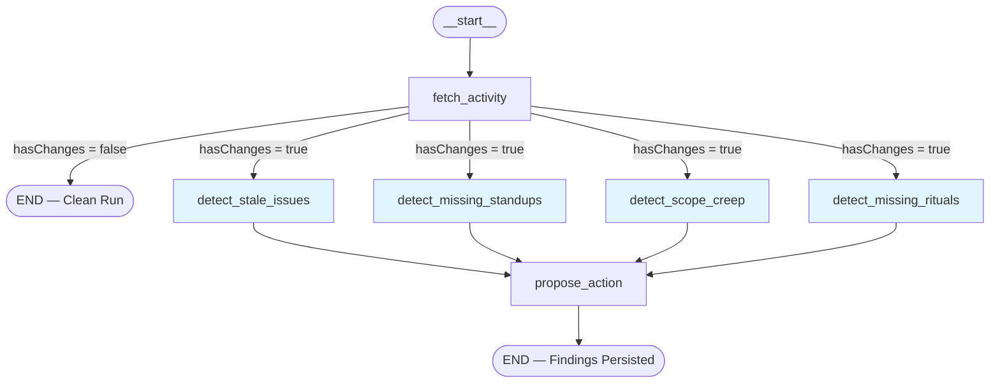
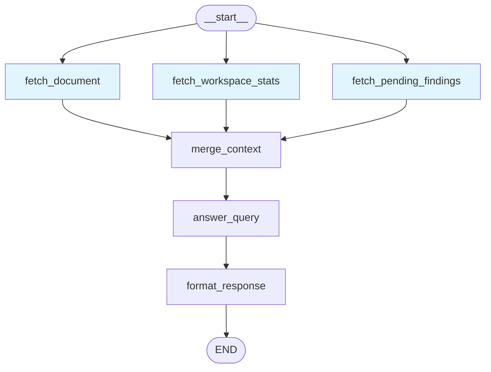

# FLEETGRAPH.md

## Agent Responsibility

FleetGraph is a **project intelligence agent** for Ship that monitors project state, reasons about what it finds, and surfaces actionable insights. It operates in two modes:

**Proactive Mode** — Runs on a schedule, detects problems (stale issues, scope creep, missing standups, missing rituals), and surfaces findings with proposed actions. All findings require human approval before any write action is taken.

**On-Demand Mode** — User invokes from the Ship UI via a context-aware chat panel scoped to what they're viewing (issue, week, project, or dashboard).

### Autonomy Boundaries

| Without approval | Requires approval |
|---|---|
| Read any workspace-visible data | Adding comments to documents |
| Compute derived metrics (velocity, scope delta) | Changing issue state or assignments |
| Generate summaries and risk assessments | Creating new documents |
| Surface findings as pending proposals | Any action modifying another user's workload |

### LLM Provider

Claude Sonnet 4 via `@langchain/anthropic`, abstracted behind a `BaseChatModel` provider interface. The provider is selected via `FLEETGRAPH_LLM_PROVIDER` env var (default: `anthropic`). Graph nodes call `getLLM().invoke()` and are provider-agnostic — swapping to OpenAI requires only adding a case to the factory, no graph code changes. LLM calls use `maxRetries: 3` with exponential backoff.

---

## Graph Diagram

### Proactive Graph — Parallel Detection with Fan-Out/Fan-In



**Key decision point:** `fetch_activity` computes an MD5 hash of recent `document_history` IDs and compares it to the stored hash. If identical, the graph short-circuits to END (Path C). If different, the conditional edge returns an **array** of four node names, triggering LangGraph's parallel fan-out.

**Merge mechanism:** The `findings` state field uses a merge reducer `(a, b) => [...a, ...b]` so all four detection nodes can write findings concurrently without clobbering each other. `propose_action` waits for all four to complete (fan-in barrier), then persists all merged findings.

**Timeout:** Every `graph.invoke()` uses `AbortSignal.timeout(30_000)` — if any graph run exceeds 30 seconds, it is killed cleanly.

### On-Demand Graph — Parallel Context Fetching



**Parallel fan-out from start:** The conditional edge from `__start__` returns `['fetch_document', 'fetch_workspace_stats', 'fetch_pending_findings']`, executing all three concurrently. `fetch_document` also uses `Promise.all` internally to fetch the document and its history in parallel.

**Fan-in:** `merge_context` waits for all three, filters empty outputs, and joins them into a single `contextData` string for the LLM.

---

## Use Cases

### Overview

| # | Use Case | Mode | Detection Node | Trigger |
|---|----------|------|---------------|---------|
| 1 | Stale issue detection | Proactive | `detect_stale_issues` | Fast poll (3 min) or slow poll (30 min) |
| 2 | Missing standup detection | Proactive | `detect_missing_standups` | Slow poll (30 min) |
| 3 | Scope creep detection | Proactive | `detect_scope_creep` | Fast poll (3 min) or slow poll (30 min) |
| 4 | Missing ritual detection | Proactive | `detect_missing_rituals` | Slow poll (30 min) |
| 5 | On-demand project health | On-demand | `answer_query` | User sends message in chat panel |
| 6 | Human-in-the-loop: approve | REST API | `execute_action` | User clicks Approve on a finding |
| 7 | Human-in-the-loop: dismiss | REST API | — | User clicks Dismiss on a finding |

### UC1: Stale Issue Detection

**What it detects:** In-progress issues with no `document_history` updates for 48+ hours.

**Decision logic:**
1. Query all issues where `properties->>'state' = 'in_progress'` and `archived_at IS NULL`
2. Pre-filter: compute `daysSinceUpdate = (now - updated_at) / 86400000`. Keep only `>= 2 days`
3. If candidates exist, send issue list to Claude with severity classification prompt
4. Claude returns JSON array: `[{ id, severity, summary, proposed_action }]`
5. **Fallback:** If Claude returns invalid JSON (non-array), use rule-based classification:
   - `>= 5 days` → high | `>= 3 days` → medium | `>= 2 days` → low

**Severity mapping:**

| Days stale | Severity | Example |
|---|---|---|
| 2–3 | low | "Issue has been in progress for 2.5 days with no activity" |
| 3–5 | medium | "Issue has been dormant for 4 days, may impact sprint" |
| 5+ | high | "Issue has been idle for 6 days, critical for user experience" |

**Test case:** `detect-stale-issues.test.ts` — "uses LLM fallback when response is invalid JSON" sends invalid JSON from mock LLM, verifies rule-based classification produces correct severity.

**Trace:** [Proactive deep scan trace](https://smith.langchain.com/public/e09239db-e51d-4210-91eb-4975c67a3f90/r) — `detect_stale_issues` node starts at 13:19:34.542, calls `ChatAnthropic` for classification (13:19:34.565–13:19:41.343), produces findings passed to `propose_action`.

**Example finding produced:**
> **[high]** "WebSocket reconnection fix has been idle for nearly 10 days, critical for user experience stability"
> **Proposed action:** "Escalate to team lead and request immediate status update"

### UC2: Missing Standup Detection

**What it detects:** Team members who haven't posted a standup in the last 24–48 hours.

**Decision logic:**
1. Fetch all `person` documents and recent standups (last 48h) **in parallel** via `Promise.all`
2. Build a map: `person_id → last_standup_timestamp`
3. For each person:
   - No standup in 48h → severity `medium`, "has not posted a standup in the last 48 hours"
   - Last standup 24–48h ago → severity `low`, includes hours since last standup

**No LLM call** — pure database query + threshold logic.

**Test case:** `detect-missing-standups.test.ts` — "detects people with no standup in 48 hours" mocks empty standup result, verifies medium-severity finding.

**Trace:** Same [proactive trace](https://smith.langchain.com/public/e09239db-e51d-4210-91eb-4975c67a3f90/r) — `detect_missing_standups` starts at 13:19:34.542, completes at 13:19:34.568 (26ms, no LLM needed).

**Example finding produced:**
> **[medium]** "Alex Rivera has not posted a standup in the last 48 hours."
> **Proposed action:** "Send a reminder to post a standup update."

### UC3: Scope Creep Detection

**What it detects:** Issues added to the current week after the weekly plan was submitted.

**Decision logic:**
1. Compute current sprint number from workspace `sprint_start_date`
2. Find current week document (`document_type = 'sprint'`, matching sprint number)
3. Fetch weekly plan and sprint issues **in parallel** via `Promise.all`
4. Compare: `issue.created_at > plan.updated_at` → scope creep
5. Severity: `>= 5 issues` → high | `>= 3` → medium | `< 3` → low

**No LLM call** — pure database query + timestamp comparison.

**Test case:** `detect-scope-creep.test.ts` — "detects issues added after plan submission" mocks plan timestamp and issues with later creation dates, verifies finding contains correct count.

**Trace:** Same [proactive trace](https://smith.langchain.com/public/e09239db-e51d-4210-91eb-4975c67a3f90/r) — `detect_scope_creep` starts at 13:19:34.542, completes at 13:19:34.564 (22ms).

**Example finding produced:**
> **[medium]** "3 issue(s) added to 'Week 12 (Mar 16-22)' after plan was submitted."
> **Proposed action:** "Review the 3 new issue(s) and decide whether to defer or accept the scope increase."

### UC4: Missing Ritual Detection

**What it detects:** Weeks without plans or retrospectives.

**Decision logic:**
1. Compute current sprint number, check current + 2 previous weeks
2. Fetch week documents and their child ritual documents (plans/retros) **in parallel** via `Promise.all`
3. For each week, check if `weekly_plan` and `weekly_retro` children exist and have real content (`JSON.stringify(content).length > 100`)
4. Missing plan on current/past week → medium (current) or high (past)
5. Missing retro on past week → always high

**No LLM call** — database query + content length check.

**Test case:** `detect-missing-rituals.test.ts` — "detects past weeks without retros as high severity" mocks a past week with no ritual documents, verifies high-severity finding.

**Trace:** Same [proactive trace](https://smith.langchain.com/public/e09239db-e51d-4210-91eb-4975c67a3f90/r) — `detect_missing_rituals` starts at 13:19:34.541, completes at 13:19:34.568 (27ms).

**Example finding produced:**
> **[high]** "Week 'Week 11 (Mar 9-15)' (Sprint 11) was completed without a retro."
> **Proposed action:** "Follow up with the week owner about writing a retrospective."

### UC5: On-Demand Project Health Query

**What it does:** User asks a question in the chat panel. FleetGraph fetches workspace context in parallel and uses Claude to reason about project health.

**Decision logic:**
1. Three context-fetch nodes run **concurrently**:
   - `fetch_document` — current document + history (if `documentId` provided)
   - `fetch_workspace_stats` — issue counts by state
   - `fetch_pending_findings` — active FleetGraph findings
2. `merge_context` combines non-empty outputs into a single context string
3. `answer_query` passes context + user message to Claude with system prompt: "You are FleetGraph, a project intelligence assistant..."
4. Claude reasons about the data and returns an actionable response

**Test case:** `merge-context.test.ts` — "combines all three context fields" verifies document context, workspace stats, and findings all appear in merged output.

**Trace:** [On-demand trace](https://smith.langchain.com/public/f07511fa-48f1-4b71-a14b-84384836a2ec/r) — Three fetch nodes start within 1ms (13:23:06.621–622), merge at 13:23:06.705, then `ChatAnthropic` reasons for ~9s, producing the response.

**Example interaction:**
> **User:** "Give me a full project health assessment."
> **Agent:** "4 high-priority issues stalled for 10 days... Workspace has 4 in-progress, 4 todo, 4 done... Recommend emergency standup to address stalled items."

### UC6: Human-in-the-Loop — Approve

**Flow:** Proactive graph creates finding → user sees it in Findings tab → clicks Approve → `execute_action` runs.

**What happens on approval:**
1. `POST /api/fleetgraph/findings/:id/approve` sets `status = 'approved'`
2. `execute_action` is called: for `stale_issue` findings, it inserts a comment on the issue: `"**FleetGraph Alert:** {summary}\n\n*Suggested action:* {proposed_action}"`
3. Finding status updated to `'executed'`

**Test case:** `propose-action.test.ts` — "inserts new findings with pending status" verifies findings are stored with `'pending'` status, ready for human review.

**Verified result:** Finding `d8aedb5c` (stale_issue, high severity) → approved → status changed to `approved` → comment added to issue.

### UC7: Human-in-the-Loop — Dismiss

**Flow:** User clicks Dismiss on a finding → 7-day suppression activated.

**What happens on dismissal:**
1. `POST /api/fleetgraph/findings/:id/dismiss` sets `status = 'dismissed'` and `dismissed_until = NOW() + 7 days`
2. Future proactive scans check `dismissed_until > NOW()` before creating new findings for the same document+type
3. After 7 days, suppression expires and the condition can be re-surfaced

**Test case:** `propose-action.test.ts` — "skips suppressed (dismissed) findings" verifies that when a dismissed finding exists within the suppression window, no duplicate is inserted.

**Verified result:** Finding `3a1c5e0b` (missing_standup) → dismissed → suppressed until 2026-03-29.

---

## Trigger Model

**Hybrid Polling** — Ship has no webhook/event system. FleetGraph polls.

### How the Agent Runs

```
┌─────────────────────────────────────────────────────────┐
│  Server starts → startPolling()                         │
│                                                         │
│  ┌─ Fast Poll (every 3 min) ──────────────────────────┐ │
│  │  For each workspace (parallel):                    │ │
│  │    fetch_activity → hash changed?                  │ │
│  │      NO  → END (0ms, $0 LLM cost)                 │ │
│  │      YES → fan-out to 4 detection nodes            │ │
│  │            → propose_action → END                  │ │
│  └────────────────────────────────────────────────────┘ │
│                                                         │
│  ┌─ Slow Poll (every 30 min) ─────────────────────────┐ │
│  │  Forces hasChanges=true (bypasses hash check)      │ │
│  │  Catches absence-based conditions:                 │ │
│  │    - Missing standups (no activity to detect)      │ │
│  │    - Missing rituals (retros/plans never created)  │ │
│  └────────────────────────────────────────────────────┘ │
│                                                         │
│  ┌─ On-Demand (user-initiated) ───────────────────────┐ │
│  │  POST /api/fleetgraph/chat                         │ │
│  │  → parallel context fetch → LLM reasoning          │ │
│  └────────────────────────────────────────────────────┘ │
└─────────────────────────────────────────────────────────┘
```

### Detection Latency

| Poll Type | Interval | LLM Cost | What It Catches |
|---|---|---|---|
| Fast poll | 3 min | $0 when no changes | Activity-based: stale issues, scope creep |
| Slow poll | 30 min | ~$0.016/scan | Absence-based: missing standups, rituals |
| On-demand | User-initiated | ~$0.026/query | Whatever the user asks about |

**Why polling:** Ship has no pub/sub or outbound events. The 3-min fast poll with activity-hash gating achieves <5 min detection latency. The hash comparison is a single DB query returning in <10ms — if nothing changed, no LLM call is made.

**Clean run trace:** [Path C — no changes](https://smith.langchain.com/public/c9b10ff8-7b48-4e54-bd8a-3e76a67af893/r) — `fetch_activity` runs (13:22:48.223–240), hash matches, conditional edge returns `__end__`. Total: 22ms, zero LLM calls, zero cost.

---

## Test Cases

**27 unit tests** across 6 test files. All use mocked database and LLM — no running PostgreSQL required.

Run: `cd api && npx vitest run --config vitest.config.fleetgraph.ts`

### Test-to-Use-Case Mapping

| Test File | Tests | Validates Use Case |
|---|---|---|
| `detect-stale-issues.test.ts` | 5 | UC1: Stale issue detection |
| `detect-missing-standups.test.ts` | 5 | UC2: Missing standup detection |
| `detect-scope-creep.test.ts` | 5 | UC3: Scope creep detection |
| `detect-missing-rituals.test.ts` | 5 | UC4: Missing ritual detection |
| `merge-context.test.ts` | 3 | UC5: On-demand context assembly |
| `propose-action.test.ts` | 4 | UC6/UC7: Finding persistence, dedup, suppression |

### Key Test Scenarios

**UC1 — Stale Issues:**
| Test | Input | Expected |
|---|---|---|
| Skips fresh issues | Issue updated 12h ago | No findings |
| LLM fallback on bad JSON | LLM returns `'{}'` (not array) | Rule-based: 4 days → medium |
| Severity thresholds | 5.5d, 3.5d, 2.5d issues | high, medium, low respectively |
| LLM classification used | LLM returns valid JSON `[{severity:"high"}]` | Uses LLM severity, not rules |
| No issues at all | Empty DB result | Empty findings array |

**UC2 — Missing Standups:**
| Test | Input | Expected |
|---|---|---|
| No people exist | Empty person query | No findings |
| Person with no standup in 48h | Person exists, no standup rows | Medium severity finding |
| Person with standup 30h ago | Standup timestamp 30h back | Low severity finding |
| Person with recent standup | Standup 2h ago | No findings |
| Queries run in parallel | Both queries fire | `pool.query` called exactly 2 times |

**UC3 — Scope Creep:**
| Test | Input | Expected |
|---|---|---|
| No workspace | Empty workspace query | No findings |
| No current week | No sprint document | No findings |
| Issues after plan | 2 issues created after plan.updated_at | 1 finding, low severity |
| High scope creep | 6 issues after plan | 1 finding, high severity |
| No plan exists | No weekly_plan document | No findings (can't measure creep without baseline) |

**UC4 — Missing Rituals:**
| Test | Input | Expected |
|---|---|---|
| No workspace | Empty workspace query | No findings |
| No weeks | No sprint documents | No findings |
| Past week without retro | Week 10 ended, no retro | High severity finding |
| Week with real content | Plan and retro with >100 chars | No findings |
| Parallel query execution | Both queries fire | `pool.query` called exactly 3 times |

**UC6/UC7 — Propose Action (HITL gate):**
| Test | Input | Expected |
|---|---|---|
| Duplicate within 24h | Same finding_type + document_id exists | Skipped (not inserted) |
| Suppressed finding | Dismissed finding with active `dismissed_until` | Skipped |
| New finding inserted | No duplicate, no suppression | Inserted with status `'pending'` |
| Parallel persistence | 2 findings submitted | Both persisted via `Promise.all` |

---

## Architecture Decisions

See [PRESEARCH.md](./PRESEARCH.md) for detailed rationale. Summary:

| Decision | Choice | Why |
|---|---|---|
| LLM Provider | Claude Sonnet 4 via Anthropic SDK | Required by spec; abstracted behind `BaseChatModel` for future OpenAI swap |
| Framework | LangGraph JS (`@langchain/langgraph`) | TypeScript consistency with Ship, native LangSmith tracing, conditional edges + parallel fan-out |
| Observability | LangSmith | Required from day one; automatic tracing via LangChain integration |
| Trigger Model | Hybrid polling (3 min fast + 30 min slow) | Ship has no webhooks; hash-gated polling minimizes LLM cost |
| Database | PostgreSQL (Ship's existing `pg` pool) | Direct DB access for agent queries, no ORM, shared connection pool |
| Human-in-the-Loop | Database state machine (pending → approved/dismissed) | Decouples detection from action execution; supports 7-day suppression |
| Error Handling | Try-catch per node + LLM fallback | One failing detection node doesn't crash the graph; invalid LLM JSON falls back to rule-based classification |
| Retry | `maxRetries: 3` on LLM, 30s graph timeout | Handles transient Claude API failures; prevents runaway executions |

### Database Schema

Three tables (migration 039):
- **`fleetgraph_findings`** — Finding type, severity, document reference, proposed action, status lifecycle (`pending` → `approved`/`dismissed`/`executed`), suppression via `dismissed_until`
- **`fleetgraph_poll_state`** — Per-workspace `activity_hash`, `last_fast_poll`, `last_slow_poll` timestamps
- **`fleetgraph_chat_messages`** — On-demand conversation history (user + assistant messages)

### API Endpoints

| Method | Path | Purpose |
|---|---|---|
| POST | `/api/fleetgraph/chat` | On-demand chat (invokes on-demand graph) |
| GET | `/api/fleetgraph/findings` | List findings (filterable by `?status=pending`) |
| POST | `/api/fleetgraph/findings/:id/approve` | Approve → execute proposed action |
| POST | `/api/fleetgraph/findings/:id/dismiss` | Dismiss → suppress for 7 days |
| GET | `/api/fleetgraph/status` | Health check: enabled, last poll, pending count |

---

## LangSmith Trace Links

All traces from production (2026-03-22), running against real Ship data.

### Trace 1 — Proactive Deep Scan (Path A: 4-way parallel detection)

**Link:** https://smith.langchain.com/public/e09239db-e51d-4210-91eb-4975c67a3f90/r

**What to look for:**
1. `fetch_activity` (13:19:34.524–540) — checks activity hash, detects changes
2. **Parallel fan-out** — all 4 detection nodes start within 1ms:
   - `detect_missing_rituals` (34.541–34.568)
   - `detect_missing_standups` (34.542–34.568)
   - `detect_scope_creep` (34.542–34.564)
   - `detect_stale_issues` (34.542–41.345) — takes longest due to LLM call
3. `ChatAnthropic` (34.565–41.343) — Claude classifies stale issue severity
4. **Fan-in** — `propose_action` (41.346–41.422) — persists merged findings from all 4 nodes

**Total:** 6.9 seconds. 3 of 4 detections complete in <30ms (pure DB). Only stale issue detection uses the LLM.

### Trace 2 — On-Demand Query (Path B: 3-way parallel context fetch)

**Link:** https://smith.langchain.com/public/f07511fa-48f1-4b71-a14b-84384836a2ec/r

**What to look for:**
1. **Parallel fan-out** — 3 fetch nodes start within 1ms:
   - `fetch_document` (06.621–06.704) — loads issue + history via `Promise.all`
   - `fetch_pending_findings` (06.622–06.701)
   - `fetch_workspace_stats` (06.622–06.705)
2. `merge_context` (06.705–06.707) — combines outputs
3. `answer_query` → `ChatAnthropic` (06.709–16.041) — Claude reasons with full context
4. `format_response` (16.043–16.044) — pass-through

**Total:** 9.4 seconds. Context fetching completes in 83ms (parallel). LLM reasoning is the bottleneck.

### Trace 3 — Clean Run (Path C: no changes, early exit)

**Link:** https://smith.langchain.com/public/c9b10ff8-7b48-4e54-bd8a-3e76a67af893/r

**What to look for:**
1. `fetch_activity` (48.223–48.240) — queries `document_history`, computes hash
2. Hash matches stored value → conditional edge returns `__end__`
3. **No detection nodes execute. No LLM calls. No findings.**

**Total:** 22ms. $0 LLM cost. This is what 95%+ of fast polls look like.

### LangSmith Dashboard

https://smith.langchain.com/o/9ec225d0-ceaf-4bba-a026-02438fa14772/projects/p/2763fbc4-bba2-47b1-8d6f-05a8f956d446

---

## Cost Analysis

| Scenario | Fast Polls/day | Deep Scans/day | LLM Cost/day |
|---|---|---|---|
| 1 workspace, low activity | 480 | ~10 | ~$0.16 |
| 1 workspace, high activity | 480 | ~96 | ~$1.54 |
| 10 workspaces, mixed | 4,800 | ~200 | ~$3.20 |

**Token budget per invocation:**
- Fast poll (no changes): 0 tokens, $0
- Proactive deep scan: ~4,000 input + ~800 output tokens (~$0.016)
- On-demand query: ~6,000 input + ~1,200 output tokens (~$0.026)

**Cost optimization:** The activity-hash check on fast polls ensures 95%+ of polling cycles cost $0. Only when data actually changed does the agent invoke Claude. The slow poll (every 30 min) catches absence-based conditions that wouldn't show up in the activity feed.

---

## Deployment

**Platform:** Railway (Docker)
**URL:** https://fleetgraph-production-614c.up.railway.app/
**Database:** Railway-managed PostgreSQL

FleetGraph runs **inside the Ship API process** — not a separate service. `startFleetGraph()` hooks into the Express server boot and starts the polling scheduler. The proactive agent queries PostgreSQL directly via the shared connection pool (no HTTP API calls, no auth tokens needed).

**Environment variables:**
```
FLEETGRAPH_ENABLED=true
ANTHROPIC_API_KEY=<key>
LANGCHAIN_TRACING_V2=true
LANGCHAIN_API_KEY=<key>
LANGCHAIN_PROJECT=fleetgraph
FLEETGRAPH_LLM_PROVIDER=anthropic  # optional, default
FLEETGRAPH_LLM_MODEL=claude-sonnet-4-20250514  # optional, default
```
